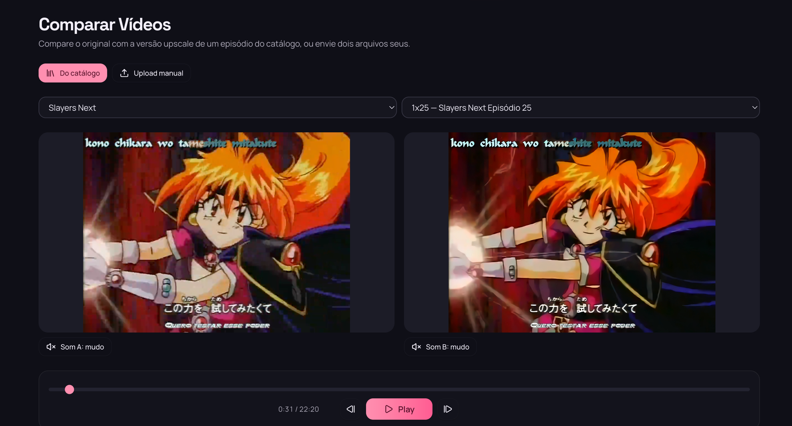

# UpAnime

Biblioteca de anime self-hosted com upscale por IA. Baixa episódios, organiza um catálogo com streaming próprio e reprocessa vídeo em GPU serverless — Real-ESRGAN AnimeVideo v3 pra super-resolução, HurrDeblur pra detalhe de line art e RIFE pra interpolação até 60fps.



*Tela Comparar: o episódio original e a versão upscaled reproduzem em sincronia, lado a lado.*

## Funcionalidades

- **Downloads** — busca animes, resolve embeds e baixa episódios direto pra sua biblioteca
- **Catálogo** — streaming com player próprio, progresso de reprodução, capas e gêneros classificados por IA
- **Upscale** — pipeline GPU no RunPod Serverless: deinterlace → denoise → Real-ESRGAN 4x → sharpen → HurrDeblur, com saída em 1080p/1440p/2160p
- **60 FPS opcional** — dedup timestamp-aware + interpolação RIFE com timestep exato, sem borrar cortes de cena
- **Comparação** — original vs. upscaled lado a lado
- **Upload manual** — adicione episódios que você já tem
- **Acesso por convite** — sem registro público: admin criado por script, convites por email, MFA por email

## Arquitetura

| Componente | Stack | Papel |
|---|---|---|
| `client/` | React + Vite + Tailwind | SPA servida pelo próprio backend |
| `api/` | Go (chi) + SQLite | Catálogo, downloads, auth, orquestração do upscale |
| `scraper/` | Python + Playwright | Resolve páginas de anime e embeds de vídeo |
| `worker/` | Python + PyTorch | Pipeline de upscale em GPU (RunPod Serverless) |
| Redis | — | Códigos de MFA e redefinição de senha (TTL 15 min) |
| Storage | Cloudflare R2 ou disco local | Arquivos de vídeo |

O app principal (client + api + scraper) roda num único container via Docker Compose, junto com o Redis. O worker de upscale roda separado, como endpoint serverless no RunPod.

## Requisitos

| Dependência | Obrigatório? | Para quê |
|---|---|---|
| Docker + Docker Compose | Sim | Rodar o app |
| SMTP | Sim (produção) | Códigos de MFA e emails de convite — sem SMTP os códigos caem no log do container (aceitável só em dev) |
| Cloudflare R2 | Para upscale | O worker baixa a fonte e sobe o resultado por URLs pré-assinadas; storage local funciona pra downloads/streaming, mas **não** pra upscale |
| RunPod | Para upscale | GPU serverless que executa o worker |
| OpenRouter | Opcional | Classificação automática de gêneros por IA |

## Subindo o app

```bash
git clone <este-repo> upanime && cd upanime
cp .env.example .env
```

Edite o `.env` (referência completa abaixo — o mínimo pra começar é o `AUTH_SECRET`):

```bash
# gere um segredo forte para as sessões
openssl rand -base64 32
```

Suba tudo:

```bash
docker compose up -d --build
```

Crie o seu usuário admin (não existe registro público — este script é a única forma de criar o primeiro usuário):

```bash
docker compose exec app ./upanime-api create-user voce@exemplo.com
```

O comando imprime uma senha temporária. Acesse **http://localhost:7891**, faça login com ela, defina sua senha definitiva e informe o código de MFA enviado por email.

> Sem SMTP configurado, o código aparece nos logs: `docker compose logs app | grep "código"`

## Variáveis de ambiente (`.env`)

| Variável | Padrão | Descrição |
|---|---|---|
| `AUTH_SECRET` | — | **Defina sempre.** Assina os cookies de sessão; se vazio, um segredo aleatório é gerado a cada boot e todas as sessões caem no restart |
| `AUTH_COOKIE_SECURE` | `0` | Use `1` quando servir atrás de HTTPS |
| `SMTP_HOST` / `SMTP_PORT` | — / `587` | Servidor SMTP para MFA e convites |
| `SMTP_USERNAME` / `SMTP_PASSWORD` | — | Credenciais SMTP |
| `SMTP_FROM` | — | Remetente dos emails |
| `REDIS_ADDR` | `redis:6379` | Já configurado pelo compose |
| `STORAGE_TYPE` | `local` | `r2` ou `local` (upscale exige `r2`) |
| `R2_ACCOUNT_ID` / `R2_ACCESS_KEY_ID` / `R2_ACCESS_SECRET` / `R2_BUCKET_NAME` | — | Credenciais do bucket R2 |
| `RUNPOD_ENDPOINT_ID` / `RUNPOD_API_KEY` | — | Endpoint serverless do worker de upscale |
| `OPENROUTER_API_KEY` / `CLASSIFIER_MODEL` | — / `anthropic/claude-sonnet-5` | Classificador de gêneros (opcional) |
| `MAX_DOWNLOADS` | `3` | Downloads simultâneos |

## Cloudflare R2

1. No painel da Cloudflare, crie um bucket em **R2 Object Storage**.
2. Em **Manage R2 API Tokens**, crie um token com permissão **Object Read & Write** no bucket.
3. Preencha no `.env`: `R2_ACCOUNT_ID` (o ID da sua conta Cloudflare), `R2_ACCESS_KEY_ID`, `R2_ACCESS_SECRET` e `R2_BUCKET_NAME`, e defina `STORAGE_TYPE=r2`.

O worker de upscale recebe URLs pré-assinadas (validade de 24h) pra baixar a fonte, e sobe o resultado direto no bucket com as mesmas credenciais.

## RunPod (worker de upscale)

O worker é uma imagem Docker própria, executada como **Serverless Endpoint**.

**1. Publique a imagem** (troque `IMAGE` no `worker/deploy.sh` pro seu registry no Docker Hub):

```bash
cd worker
./deploy.sh --patch   # build linux/amd64 + push, com bump de versão
```

O build baixa os pesos dos modelos (Real-ESRGAN AnimeVideo v3, HurrDeblur e RIFE v4.25) pra dentro da imagem — a primeira publicação demora.

**2. Crie o endpoint** em RunPod → Serverless → New Endpoint:

- **Container image**: `seu-usuario/upanime-worker:latest`
- **GPU**: 16 GB+ de VRAM recomendado (24 GB pra saída em 4K com folga)
- **Environment variables**: copie de `worker/docker.env.example` — as credenciais R2 são obrigatórias; `WORKER_TEMPORAL_SMOOTH=0` desliga a suavização anti-flicker se quiser comparar

**3. Conecte o app**: preencha `RUNPOD_ENDPOINT_ID` e `RUNPOD_API_KEY` no `.env` e reinicie (`docker compose up -d`).

O app enfileira jobs no endpoint e acompanha o status por polling — nenhuma porta de entrada é necessária no seu servidor.

### Desempenho e custo

Referência real: um episódio de ~23 minutos (33.685 frames) no pipeline padrão (Real-ESRGAN + HurrDeblur, sem RIFE), medido em produção numa **RTX 5090 32 GB**:

| Resolução de saída | Throughput (medido) | Tempo por episódio (~23 min) | Custo por episódio¹ |
|---|---|---|---|
| 1080p (Full HD) | ~70 fps | ~8 min | **~US$ 0,21** |
| 1440p (2K) | 50–60 fps | ~9–11 min | **~US$ 0,25–0,30** |
| 2160p (4K) | ~38 fps | ~15 min | **~US$ 0,39** |

¹ Com o *flex worker* de RTX 5090 do RunPod Serverless a US$ 1,58/h (julho/2026) — confira os valores atuais em [runpod.io/pricing](https://www.runpod.io/pricing). Uma RTX 4090 (US$ 1,10/h) rende na faixa de ~30% menos throughput, com custo por episódio parecido — a 5090 entrega mais rápido pelo mesmo preço.

A interpolação RIFE 60fps é opcional e consideravelmente mais lenta que o pipeline padrão; o throughput aparece em tempo real nos logs do worker (`processed N/M frames at X fps`).

## Email (SMTP)

Usado em dois fluxos: **códigos de MFA** (login em IP/localização nova ou após 30 dias sem validação) e **convites** (a senha temporária do convidado é enviada por email). Qualquer provedor SMTP funciona — Gmail com senha de app, Resend, Mailgun, Postmark ou um relay próprio.

Sem SMTP configurado o app não quebra: os emails são registrados no log do container com um aviso. Use isso apenas em desenvolvimento — em produção, sem SMTP ninguém recebe código de MFA nem convite.

## Autenticação e convites

- **Sem registro público.** O primeiro usuário (admin) nasce do script `create-user`; só admins veem a tela **Convites** e podem convidar.
- Convidados recebem a senha temporária por email, trocam no primeiro login e **não** podem convidar outros.
- **MFA por email**: disparado quando o IP ou a localização mudam, ou quando a última validação tem mais de 30 dias. O código de 6 dígitos vive no Redis por 15 minutos e é invalidado após 5 tentativas erradas.
- "Esqueci minha senha" na tela de login envia um código de redefinição pelo mesmo mecanismo.

## Comandos de manutenção

O binário aceita subcomandos além de subir o servidor:

```bash
# criar o primeiro usuário admin
docker compose exec app ./upanime-api create-user voce@exemplo.com

# classificar gêneros de todos os animes ainda sem categoria (via OpenRouter)
docker compose exec app ./upanime-api classify
```

O `classify` pula quem já tem gênero, então pode ser rodado quantas vezes quiser. Requer `OPENROUTER_API_KEY` no ambiente.

## Desenvolvimento

```bash
# API (Go)
cd api && go test ./...

# Client (React)
cd client && pnpm install && pnpm test
pnpm dev   # dev server com mocks (MSW)

# Worker (Python)
cd worker && uv sync && uv run pytest
```

Regras do projeto em [AGENTS.md](AGENTS.md) — resumo: toda feature com testes de unidade e integração (integração com banco real, nunca mockado), funções pequenas e guard clauses.

## Licença

A definir.
